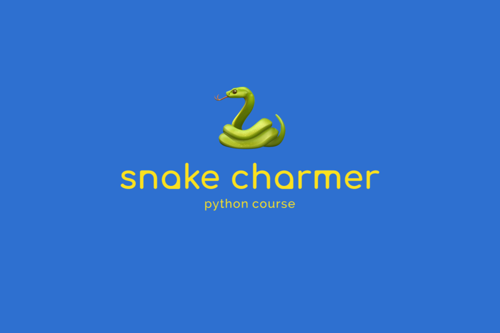

# 🐍 Snake Charmer Guide

In this repo you will find all material related to the Python beginner course held at the TU Dresden in the winter term 2019/20.

### [📣 Feedback](https://bit.ly/2GZ3ApT)

### [📺 Presentation](https://nick-lehmann.github.io/SnakeCharmerGuide)

### [🕹 Games](https://github.com/nick-lehmann/SnakeCharmerGuide/tree/master/games)

### [📄 Outline](https://github.com/nick-lehmann/SnakeCharmerGuide/tree/master/outline.md)


## Contact

- [Nicco](mailto:hi@nicco.io)

## 🚀 Project ideas

By the end of this course, every

- 📄 PDF Merger & Downloader Utility
- 📹 Youtube Downloader
- 🤖 Telegram Bot

If you have an idea for a project that you would like to see realised and explained, we are open for suggestions.


## 💪🏻 Exercises

In the exercises folder, you will find many prepared Python files that already include scaffolds.

Say you want to run the `factorial.py` exercise. After navigating to the directory with all the exercises, the following command will run the tests.

```bash
python3 factorial.py
```

_NOTE:_ Depending on your operating system and installation method, the interpreter could also be called `python` or `python38`.

## 🎓 Anatomy of an exercise

All exercises follow a similar structure but contain lines you might not understand at the start of this course. Don't worry, things will start to become a lot clearer during the course. Nevertheless, the structure will be explained here, for the sake of completeness.

```python
import unittest
```

These two lines import functionality implemented by somebody else. In this case, the `unittest` module is included with python and maintained by the core developers. It allows you to test your code automatically and is responsible for actually running the tests.

```python
def factorial(num: int) -> int:
    """
    Return the factorial of the given number.
    """
    pass
```

Each exercise will contain one or more functions that you should implement. All function parameters (`num`) have their type annotated so you know what type of input you can expected (`int`). The return value is also annotated to let you know what type of output your implementation should produce.

The description is what the function should actually do is given as a docstring (the thing between the triple quotes). No exercise requires you to have any prior knowledge about the topic of the exercise, as the explanation found here should be sufficient.

The `pass` statement is just a placeholder and should be replaced with your implementation.

```python
class FactorialTestCase(unittest.TestCase):
    def test_factorial(self):
        self.assertEqual(factorial(0), 1)
        self.assertEqual(factorial(1), 1)
        self.assertEqual(factorial(2), 2)
        self.assertEqual(factorial(3), 6)
        self.assertEqual(factorial(5), 120)
        self.assertEqual(factorial(20), 2432902008176640000)
```

When you use the `unittest` module, it is necessary to group your tests into test cases. These are represented as classes (`FactorialTestCase`) and the single tests are written as methods of this class (`test_factorial`). All test cases should inherit from the `TestCase` class.

The thing that is important for you right at the beginning are all lines containing an `assertEqual` or similar. They represent the expected behaviour of your implementation and cause tests to fail when the generated output differs from what is expected.

```python
unittest.main()
```

This last line starts running the tests and is the reason for the output you see in your terminal.
